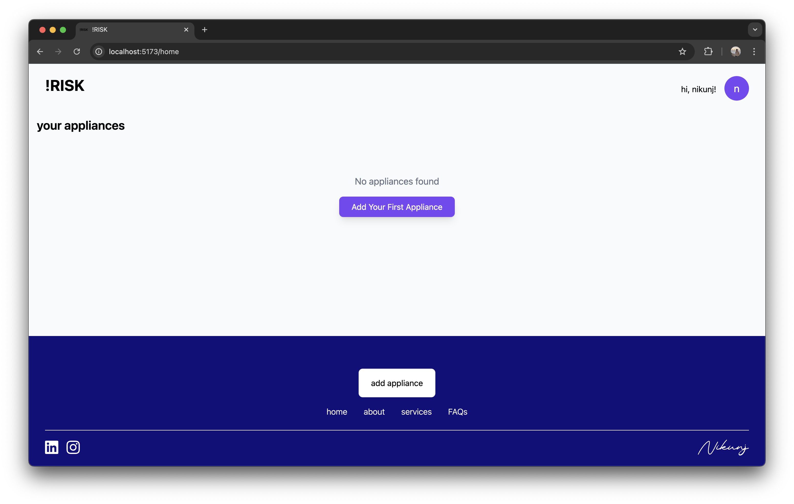
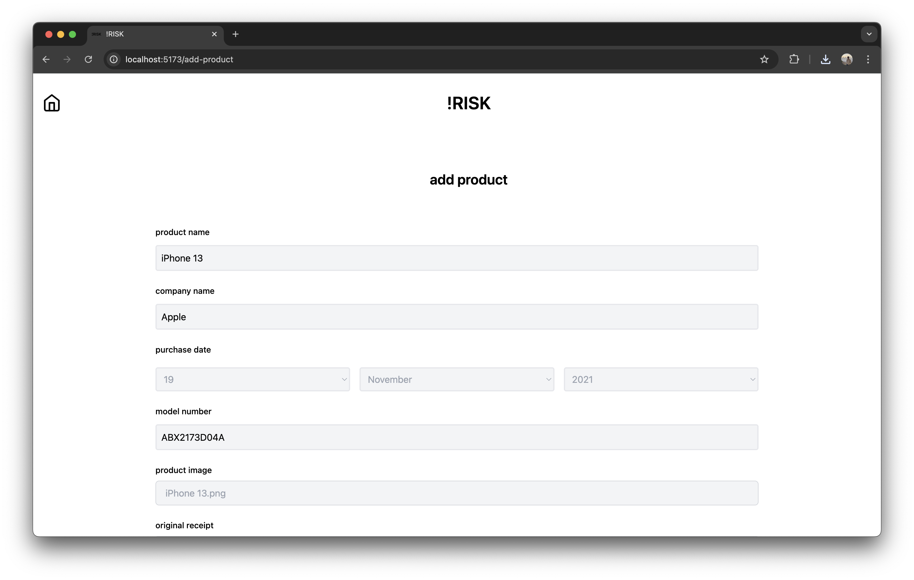
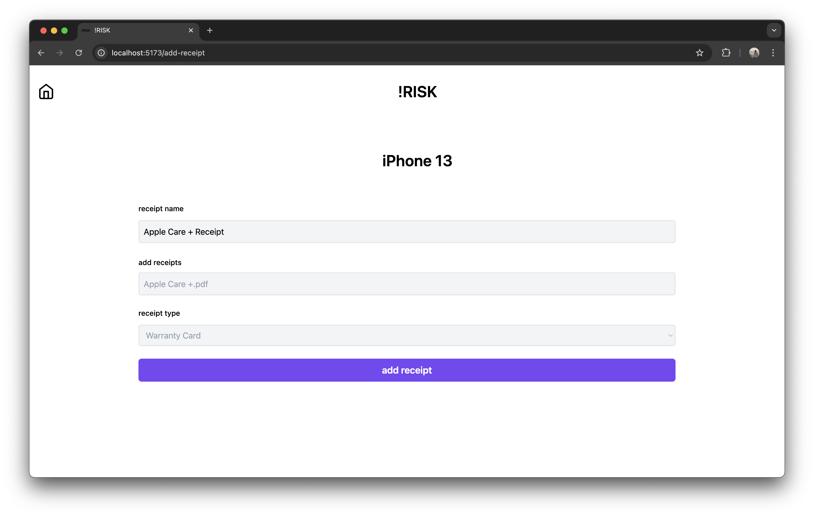
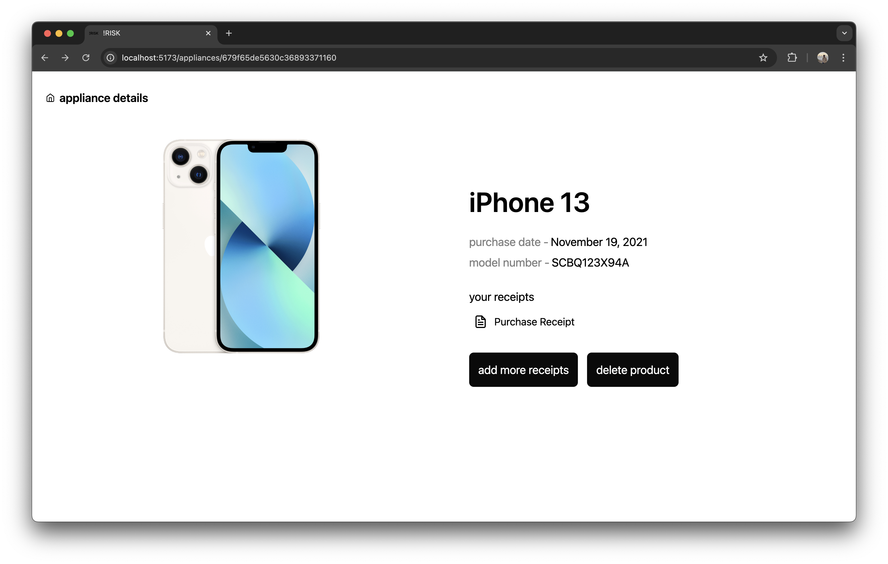
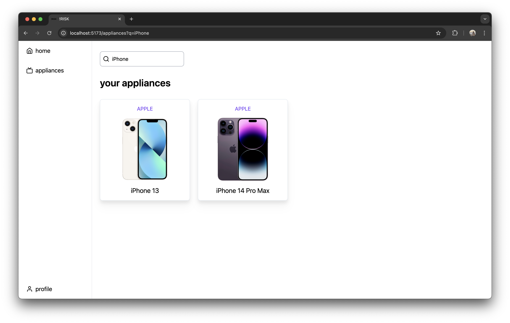

# !RISK - receipts insurance services keeper

a revolutionary service that simplifies your life by effortlessly managing receipt tracking. ever found yourself searching for a specific bill related to a product that requires service? yes we’ve all been there. !RISK is here to alleviate this hassle by effortlessly tracking all your appliances. a modern web application for managing home appliances, their receipts, and related documentation.

## features

### appliance management
- add and track your home appliances with detailed information
- maintain comprehensive records of your household items
- intuitive "add new product" form for easy onboarding
- step-by-step guidance for first-time users

> for new users: click the "add new product" button on the dashboard to start adding your first appliance. the form will guide you through entering essential details like product name, purchase date, and uploading your receipt.


*dashboard showing the overview of appliances with the add new product button*

#### add new product
- simple guided process for registering appliances
- clearly labeled fields for product details (name, company, model number)
- support for multiple document types:
  - product images (JPG, PNG, WEBP, max 5MB)
  - receipts (PDF, JPG, PNG, max 10MB)
  - optional insurance and warranty documents
- instant dashboard updates upon submission


*add new product form for your appliance*

### receipt & document storage
- digitally store and organize purchase receipts
- securely manage warranty documents
- upload and view product images and documentation


*receipt upload and management interface*

### detailed product information
- track manufacturer details and model numbers
- store complete appliance specifications
- manage warranty periods and service history


*appliance details page showing product information, receipts, and documents*

### smart search functionality
- easily find appliances using the search feature
- filter by categories, dates, or manufacturers
- quick access to all your stored information


*search functionality demonstrating how users can find their appliances*

### responsive design
- full mobile and desktop support
- seamless experience across all devices
- modern and intuitive interface

## tech stack

### frontend
- React with TypeScript
- Vite for build tooling
- React Router for navigation
- Tailwind CSS for styling
- Modern ES6+ JavaScript

### backend
- Node.js
- Express.js
- MongoDB for database
- JWT for authentication

## prerequisites

- Node.js (v14 or higher)
- MongoDB
- npm or yarn package manager

## installation

### backend setup

1. navigate to the backend directory:
   ```bash
   cd backend
   ```

2. install dependencies:
   ```bash
   npm install
   ```

3. create a .env file based on .env.example and configure your environment variables:
   ```
   MONGODB_URI=your_mongodb_connection_string
   JWT_SECRET=your_jwt_secret
   PORT=3000
   ```

4. start the backend server:
   ```bash
   npm start
   ```

### frontend setup

1. navigate to the frontend directory:
   ```bash
   cd frontend
   ```

2. install dependencies:
   ```bash
   npm install
   ```

3. create a .env file based on .env.example and configure your environment variables:
   ```
   VITE_API_URL=http://localhost:3000/api/v1
   ```

4. start the development server:
   ```bash
   npm run dev
   ```

## usage

1. register a new account or login with existing credentials
2. add your appliances with required information:
   - product name
   - company name
   - model number
   - purchase date
   - product image
   - original receipt
   - optional insurance documents
3. view and manage your appliances from the dashboard
4. search for specific appliances using the search feature
5. add or update receipts and documentation as needed


## API endpoints

### authentication
- `POST /api/v1/user/register` - register new user
- `POST /api/v1/user/login` - user login

### appliances
- `GET /api/v1/appliances` - get all appliances
- `POST /api/v1/appliances` - add new appliance
- `GET /api/v1/appliances/:id` - get specific appliance
- `PUT /api/v1/appliances/:id` - update appliance
- `DELETE /api/v1/appliances/:id` - delete appliance

## development

### project structure

```
├── backend/
│   ├── routes/         # API routes
│   ├── utils/          # utility functions
│   ├── index.js        # entry point
│   └── db.js           # database configuration
├── frontend/
│   ├── src/
│   │   ├── components/ # React components
│   │   ├── pages/      # page components
│   │   ├── utils/      # utility functions
│   │   └── types/      # TypeScript types
│   └── public/         # static assets
```

### contributing

1. fork the repository
2. create a new branch for your feature
3. make your changes
4. submit a pull request

## license

MIT License

## support

for support, please open an issue in the repository.